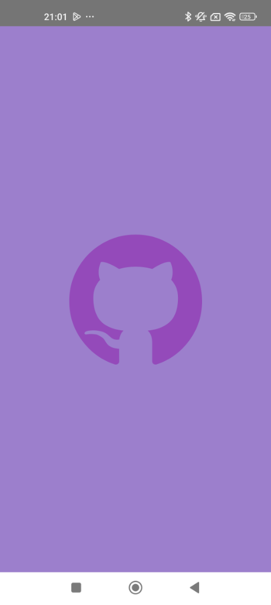
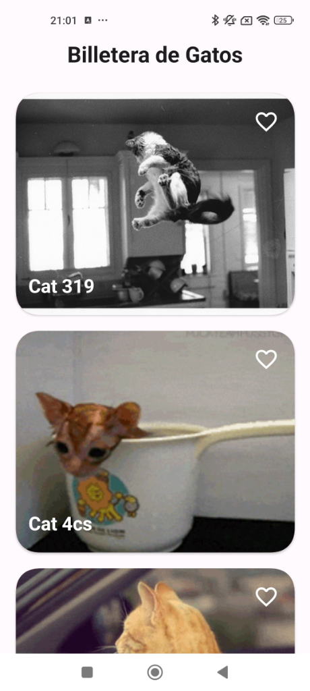
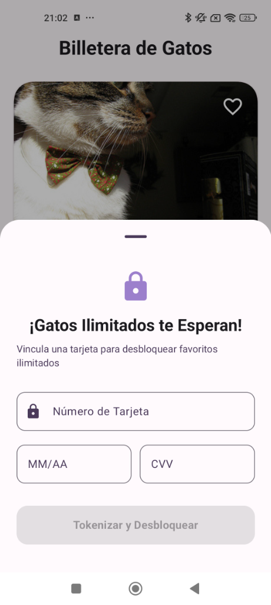

# Cat Wallet App 🐱💳

A modern Android application showcasing Clean Architecture with MVVM pattern, featuring random cat images, favorites management, and payment tokenization for unlimited access.

## Experiencia de usuario

Este proyecto contiene las siguientes características:

* **Splash Screen Animado** - Animación Lottie del Purple Git Cat
* **Pantalla principal** - Lista de gatos aleatorios con imágenes de The Cat API
* **Sistema de favoritos** - Gestión de gatos favoritos (límite de 3 gratis)
* **Pull-to-Refresh** - Actualización de la lista deslizando hacia abajo
* **Tokenización de pago** - Desbloqueo de favoritos ilimitados mediante tokenización
* **Multi-idioma** - Soporte para Español e Inglés
* **Tema personalizado** - Diseño purple-pink gradient en toda la aplicación

## Capturas de pantalla

<p align="center">
  
  
  
</p>

## Implementación

### API Utilizada

Este proyecto implementa:

* **The Cat API**: `https://api.thecatapi.com/v1/images/search` - Para obtener imágenes aleatorias de gatos
* **Mock Payment API**: `https://api.example.com/tokenize` - Simulación de tokenización de métodos de pago

### Arquitectura

Este proyecto implementa **Clean Architecture + MVVM + Modularización**

```
┌─────────────────────────────────────────────┐
│              APP (UI Layer)                 │
│  - SplashActivity, MainActivity             │
│  - CatListScreen, PaymentBottomSheet        │
│  - Compose UI, Theme, Navigation            │
└─────────────────┬───────────────────────────┘
                  │
┌─────────────────▼───────────────────────────┐
│         PRESENTATION (ViewModels)           │
│  - CatListViewModel                         │
│  - UI State Management                      │
└─────────────────┬───────────────────────────┘
                  │
┌─────────────────▼───────────────────────────┐
│          DOMAIN (Use Cases)                 │
│  - GetCatListUseCase                        │
│  - ToggleFavoriteUseCase                    │
│  - TokenizePaymentMethodUseCase             │
│  - Entities: Cat, PaymentToken              │
│  - Repositories (Interfaces)                │
└─────────────────┬───────────────────────────┘
                  │
┌─────────────────▼───────────────────────────┐
│       DATA (Repository Implementation)      │
│  - CatRepositoryImpl                        │
│  - PaymentRepositoryImpl                    │
│  - Data Sources, DTOs, Mappers              │
└─────────────────┬───────────────────────────┘
                  │
┌─────────────────▼───────────────────────────┐
│     FRAMEWORK (External Dependencies)       │
│  - Retrofit (API calls)                     │
│  - Room (Local database)                    │
│  - Coil (Image loading)                     │
│  - DataStore (Token storage)                │
└─────────────────────────────────────────────┘
```

#### Módulos

El proyecto está dividido en 4 módulos independientes:

1. **`:app`** - Capa de presentación UI
2. **`:domain`** - Lógica de negocio y casos de uso
3. **`:data`** - Implementación de repositorios y fuentes de datos
4. **`:framework`** - Implementaciones de infraestructura (Retrofit, Room, etc.)

#### Capas

##### App (UI)
* **Screens**: `CatListScreen`, `SplashActivity`
* **Components**: `CatItem`, `PaymentBottomSheet`
* **Theme**: `Color.kt`, `Theme.kt`, `Typography.kt`
* **Navigation**: Compose Navigation

##### Presentation (ViewModels)
* `CatListViewModel` - Gestiona el estado de la pantalla principal
* **Estados**: `CatListUiState` (loading, error, success)
* **Eventos**: Cargar gatos, toggle favoritos, tokenizar pago

##### Domain (Use Cases)
* `GetCatListUseCase` - Obtiene y combina datos de gatos (API + DB)
* `ToggleFavoriteUseCase` - Gestiona favoritos con reglas de negocio
* `TokenizePaymentMethodUseCase` - Tokeniza métodos de pago
* **Entities**: `Cat`, `PaymentToken`
* **Repositories** (Interfaces): `CatRepository`, `PaymentRepository`

##### Data (Repositories)
* `CatRepositoryImpl` - Implementación del repositorio de gatos
* `PaymentRepositoryImpl` - Implementación del repositorio de pagos
* **Data Sources**: `RemoteCatDataSource`, `LocalCatDataSource`
* **DTOs**: `CatDto`, objetos de transferencia de datos
* **Mappers**: Conversión entre DTOs y Entities

##### Framework (Infrastructure)
* **Retrofit**: Cliente HTTP para consumir APIs REST
* **Room**: Base de datos local para persistencia
* **Coil**: Librería de carga de imágenes optimizada para Compose
* **DataStore**: Almacenamiento de tokens y preferencias
* **Gson**: Serialización/deserialización JSON
* **Dagger Hilt**: Inyección de dependencias

#### Test Unitarios

Se implementan **19 tests** en las capas: Domain (Use Cases)

```kotlin
// Domain Layer Tests
✅ GetCatListUseCaseTest (5 tests)
   - Éxito con datos del repositorio
   - Manejo de errores
   - Lista vacía
   - Integridad de datos

✅ ToggleFavoriteUseCaseTest (7 tests)
   - Toggle de favoritos existentes
   - Agregar favorito bajo límite
   - Error al alcanzar límite (3 favoritos)
   - Acceso ilimitado con token
   - Tests de boundary conditions

✅ TokenizePaymentMethodUseCaseTest (7 tests)
   - Tokenización exitosa
   - Guardado de token
   - Manejo de errores de red
   - Validación de parámetros
```

**Cobertura de pruebas**: 100% en capa de dominio (Use Cases)

### Bibliotecas y Tecnologías

#### Gestión de solicitudes HTTP
* **Retrofit** (2.11.0) - Cliente REST type-safe
* **OkHttp** - Interceptores y logging
* **Gson** - Conversión JSON

#### Persistencia de datos
* **Room** (2.6.1) - Base de datos SQLite
* **DataStore** - Almacenamiento key-value

#### Carga de imágenes
* **Coil** (2.7.0) - Librería de imágenes para Compose

#### Inyección de dependencia
* **Dagger Hilt** (2.52) - Framework DI para Android

#### UI/UX
* **Jetpack Compose** - UI declarativa moderna
* **Material 3** - Sistema de diseño
* **Lottie** (6.3.0) - Animaciones vectoriales
* **Compose Navigation** - Navegación entre pantallas

#### Testing
* **JUnit** (4.13.2) - Framework de pruebas
* **MockK** (1.13.8) - Biblioteca de mocks para Kotlin
* **Coroutines Test** (1.7.3) - Pruebas de coroutines
* **Turbine** (1.0.0) - Pruebas de Flows

#### Build Tools
* **Gradle** (8.7.0) - Sistema de compilación
* **Kotlin** (1.9.0) - Lenguaje principal
* **KSP** - Procesamiento de anotaciones

## Características Técnicas

### Clean Architecture

La aplicación sigue los principios de Clean Architecture:

1. **Independencia de frameworks**: La lógica de negocio no depende de Android
2. **Testeable**: Cada capa puede testearse independientemente
3. **Independiente de UI**: El UI es fácil de cambiar sin afectar la lógica
4. **Independiente de DB**: Room puede reemplazarse por otra solución
5. **Independiente de agentes externos**: APIs pueden cambiar fácilmente

### Principios SOLID

* **S**ingle Responsibility: Cada clase tiene una única responsabilidad
* **O**pen/Closed: Abierto para extensión, cerrado para modificación
* **L**iskov Substitution: Las interfaces son implementables sin romper contratos
* **I**nterface Segregation: Interfaces pequeñas y específicas
* **D**ependency Inversion: Dependemos de abstracciones, no de implementaciones

### Patrones de Diseño

* **MVVM** - Model-View-ViewModel
* **Repository Pattern** - Abstracción de fuentes de datos
* **Use Case Pattern** - Encapsulación de lógica de negocio
* **Dependency Injection** - Inversión de control con Hilt
* **Observer Pattern** - StateFlow para reactividad

## Instalación y Ejecución

### Requisitos

* Android Studio Hedgehog | 2023.1.1 o superior
* Gradle 8.7.0
* Kotlin 1.9.0
* JDK 17
* Android SDK 34 (compileSdk)
* Dispositivo/Emulador con API 24+ (Android 7.0+)

### Clonar el repositorio

```bash
git clone https://github.com/yourusername/CatWalletApp.git
cd CatWalletApp
```

### Compilar el proyecto

```bash
./gradlew build
```

### Ejecutar tests

```bash
# Todos los tests
./gradlew test

# Tests por módulo
./gradlew :domain:test
./gradlew :data:test
./gradlew :app:test
```

### Ejecutar la aplicación

```bash
# Debug
./gradlew :app:assembleDebug

# Release
./gradlew :app:assembleRelease
```

O simplemente presiona **▶ Run** en Android Studio

## Estructura del Proyecto

```
CatWalletApp/
├── app/                          # Módulo de aplicación (UI)
│   ├── src/main/
│   │   ├── java/.../ui/
│   │   │   ├── splash/          # Splash screen con Lottie
│   │   │   ├── catlist/         # Pantalla principal
│   │   │   ├── payment/         # Bottom sheet de pago
│   │   │   └── theme/           # Tema y colores
│   │   ├── res/
│   │   │   ├── raw/             # purple_cat_splash.json
│   │   │   └── values/          # Strings, colors, themes
│   │   └── AndroidManifest.xml
│   └── build.gradle.kts
│
├── domain/                       # Módulo de dominio
│   ├── src/main/java/.../domain/
│   │   ├── model/               # Entities: Cat, PaymentToken
│   │   ├── repository/          # Interfaces de repositorios
│   │   ├── usecase/             # Casos de uso
│   │   └── util/                # Constantes y utilidades
│   └── build.gradle.kts
│
├── data/                         # Módulo de datos
│   ├── src/main/java/.../data/
│   │   ├── repository/          # Implementaciones
│   │   ├── datasource/          # Data sources
│   │   ├── dto/                 # DTOs
│   │   └── mapper/              # Entity ↔ DTO mappers
│   └── build.gradle.kts
│
├── framework/                    # Módulo de framework
│   ├── src/main/java/.../framework/
│   │   ├── api/                 # Retrofit interfaces
│   │   ├── db/                  # Room database
│   │   ├── di/                  # Hilt modules
│   │   └── datasource/          # Implementaciones
│   └── build.gradle.kts
│
├── gradle/                       # Configuración Gradle
│   └── libs.versions.toml       # Catálogo de versiones
├── build.gradle.kts
├── settings.gradle.kts
└── README.md
```

## Funcionalidades

### 1. Splash Screen Animado
- Animación Lottie del Purple Git Cat
- Transición suave a la pantalla principal
- Fondo con gradiente purple-pink

### 2. Lista de Gatos
- Carga de imágenes aleatorias desde The Cat API
- Pull-to-refresh para actualizar
- Visualización en cards con diseño moderno
- Botón de favoritos en cada card

### 3. Sistema de Favoritos
- Límite de 3 favoritos para usuarios gratuitos
- Persistencia local con Room
- Indicador visual de favoritos
- Desbloqueo de favoritos ilimitados

### 4. Tokenización de Pago
- Bottom sheet moderno para ingresar datos de tarjeta
- Simulación de tokenización segura
- Almacenamiento del token con DataStore
- Desbloqueo automático de favoritos ilimitados

### 5. Multi-idioma
- Soporte para Español e Inglés
- Cambio automático según idioma del dispositivo

## Próximas Mejoras

- [ ] Tests de UI con Compose Testing
- [ ] Tests de integración
- [ ] CI/CD con GitHub Actions
- [ ] Modo oscuro mejorado
- [ ] Compartir gatos favoritos
- [ ] Búsqueda de gatos por raza

## Autor

**Felipe Chaux**
- GitHub: [@felipechaux](https://github.com/felipechaux)

---

**Desarrollado con ❤️ usando Clean Architecture y Jetpack Compose**
